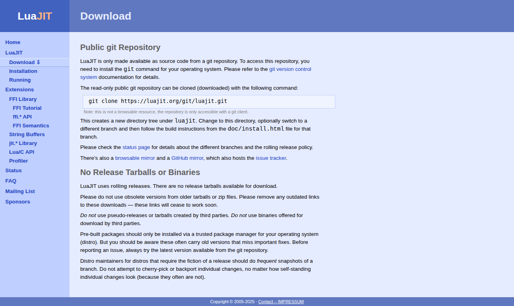

# Visited: http://luajit.org/download.html
**Time:** Fri May  1 20:51:52 UTC 2026

## Screenshot

## Raw HTML
[page.html](./page.html)

## Downloaded Media (0 files)
_No media files downloaded_

## Other Links
- [bluequad-print.css](bluequad-print.css)
- [bluequad-touch.css](bluequad-touch.css)
- [bluequad.css](bluequad.css)
- [contact.html](contact.html)
- [download.html](download.html)
- [ext_buffer.html](ext_buffer.html)
- [ext_c_api.html](ext_c_api.html)
- [ext_ffi.html](ext_ffi.html)
- [ext_ffi_api.html](ext_ffi_api.html)
- [ext_ffi_semantics.html](ext_ffi_semantics.html)
- [ext_ffi_tutorial.html](ext_ffi_tutorial.html)
- [ext_jit.html](ext_jit.html)
- [ext_profiler.html](ext_profiler.html)
- [extensions.html](extensions.html)
- [faq.html](faq.html)
- [https://git-scm.com](https://git-scm.com)
- [https://github.com/LuaJIT/LuaJIT](https://github.com/LuaJIT/LuaJIT)
- [https://github.com/LuaJIT/LuaJIT/issues](https://github.com/LuaJIT/LuaJIT/issues)
- [https://luajit.org](https://luajit.org)
- [https://repo.or.cz/w/luajit-2.0.git](https://repo.or.cz/w/luajit-2.0.git)
- [index.html](index.html)
- [install.html](install.html)
- [list.html](list.html)
- [luajit.html](luajit.html)
- [running.html](running.html)
- [sponsors.html](sponsors.html)
- [status.html](status.html)

## Stats
- Links: 27
- Media: 0
